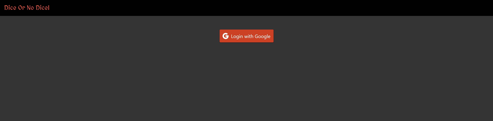
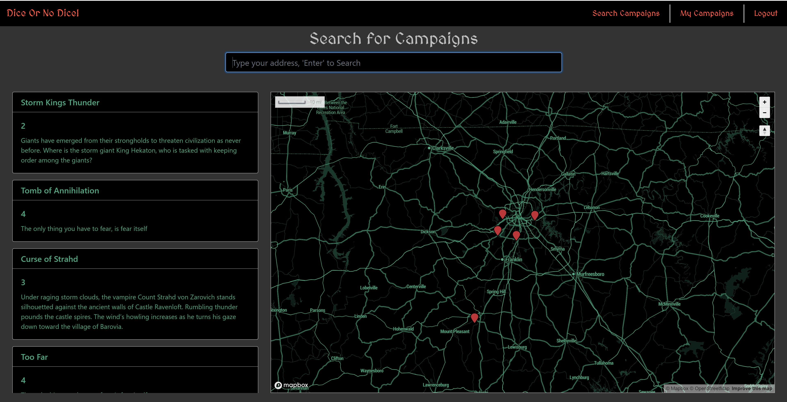
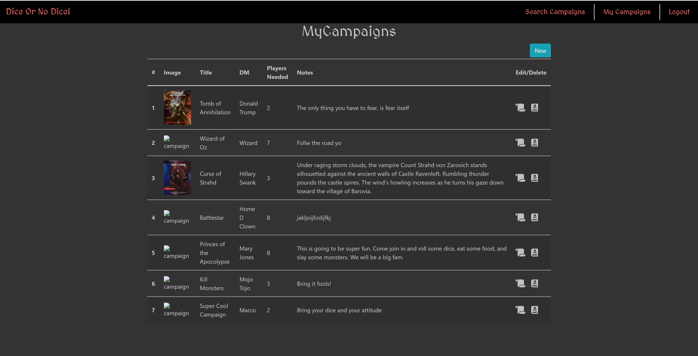

# RPG-LOCATOR

This is my Front-End capstone project designed to test my skills learned over the last 6-months of evening classes as Nashville Software School (NSS).

This is a site that can be used to search for any Role-Playng Games that are in search of additional players. You as a DM have the ability to enter your campaign that will show up in searches in and around your area.

## Requirements

- Use create-react-app to start a new react project
- Leverage Github projects for task tracking
- Add Google Authentication via Firebase
- When a user is not logged in they should see a NavBar with a login button
- When a user is logged in they should see the navbar with a logout button and the mockup layout
- Users should be able to search from the home page and if there are any campaigns within 35 Miles of the selected address you shoudl see a list of them on the left and markers on the map.
- Users shuould be able to Create, Read, Update, & Delete their own campaigns

## Screenshots

#### Login Page

#### Home Page

#### Campaigns Page

## How to run this project

### Requirements

- Firebase Account - (https://firebase.google.com/)
- Bing Maps Key - (https://www.bingmapsportal.com/)
- Mapbox Key - (https://www.mapbox.com/)
- Windows Users may need to install _**win-node-env**_ globally or as optional dependency to the project
  - `npm install -g win-node-env`
  - `npm install --save-optional win-node-env`
- Use the `/src/helpers/apiKeys.js.example` enter your API Key information and rename to `apiKeys.js`

### Start Project

- Setup Firebase
  - Create a project
  - Enable Google Authentication - [Before you Begin Section](https://firebase.google.com/docs/auth/web/google-signin?authuser=0)
  - Create a Firebase **Realtime Database** (Not Firestore)
  - Import the `Seed` data located in the `/db/` folder
    - Import `!base` to setup the collections
    - Import `campaigns.json`, `markers.json`, and `users.json` in their respective collection
  - Create Index in Rules (Look at /db/firebaseRules.json)
- Clone the repo
- Browse to the repo directory in your terminal
- Type `npm install` to install dependencies
- Type `npm start` to run the project at [http://localhost:3000](http://localhost:3000)
